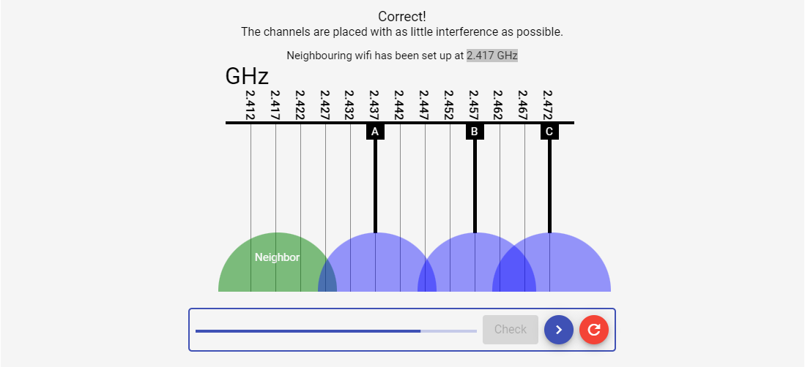
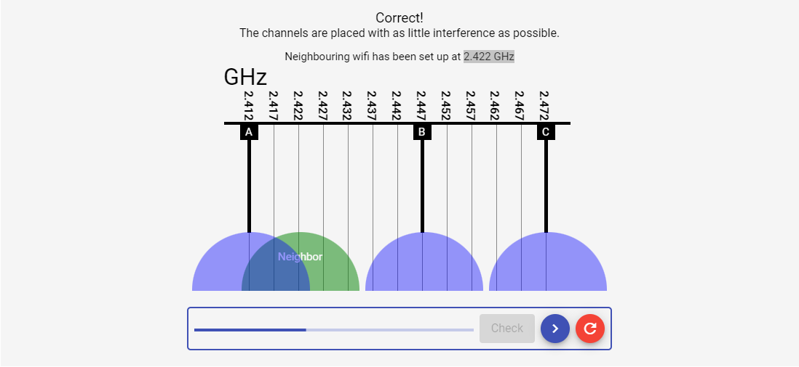
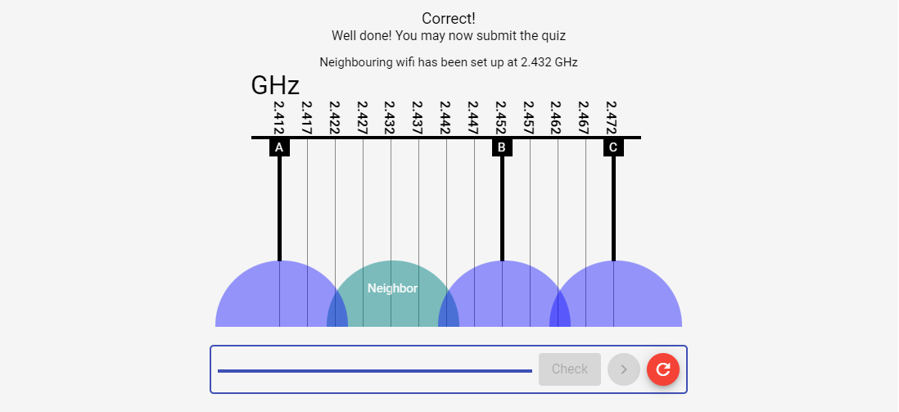
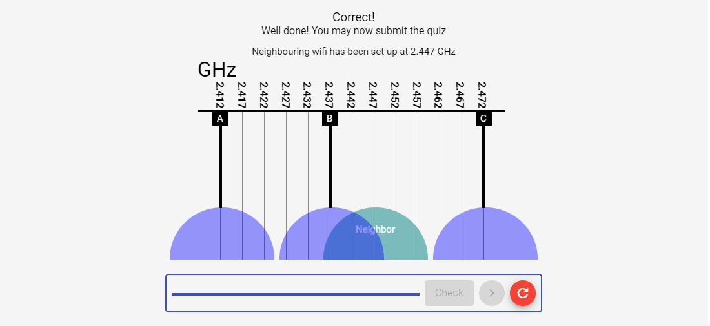
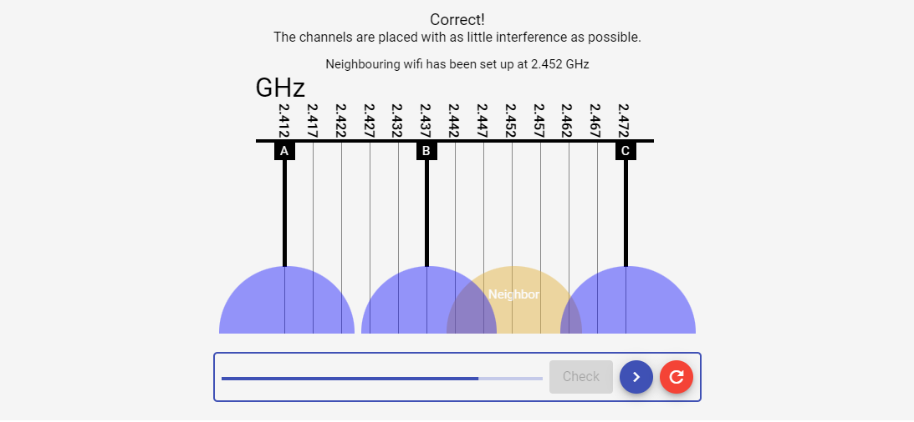
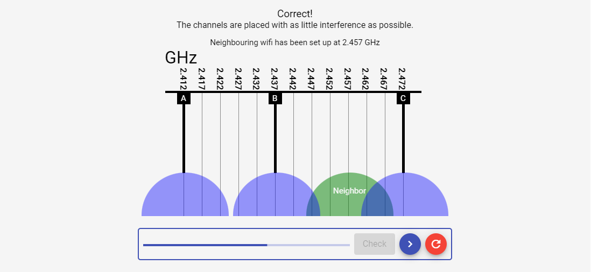
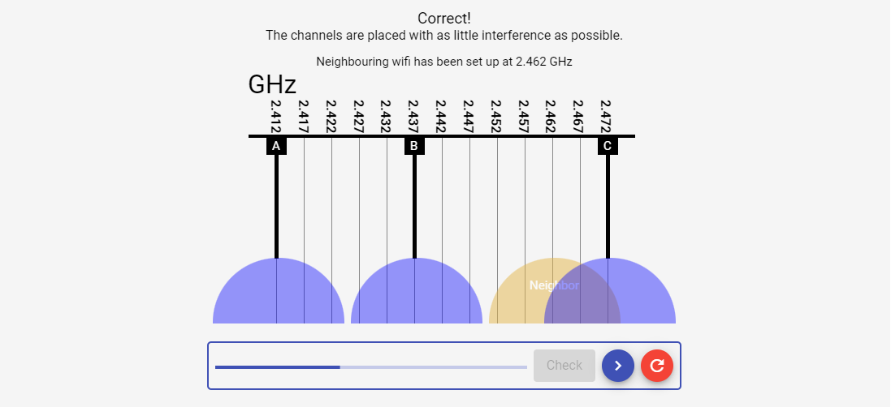

# The Bits and Bytes of Computer Networking | Week-5

## Wireless Channels

### Question 2.417 GHz

### Question 2.422 GHz

### Question 2.432 GHz

### Question 2.447 GHz

### Question 2.452 GHz

### Question 2.457 GHz

### Question 2.462 GHz

### Question 2.467 GHz

